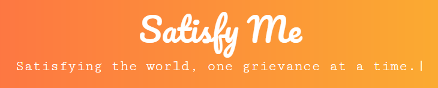
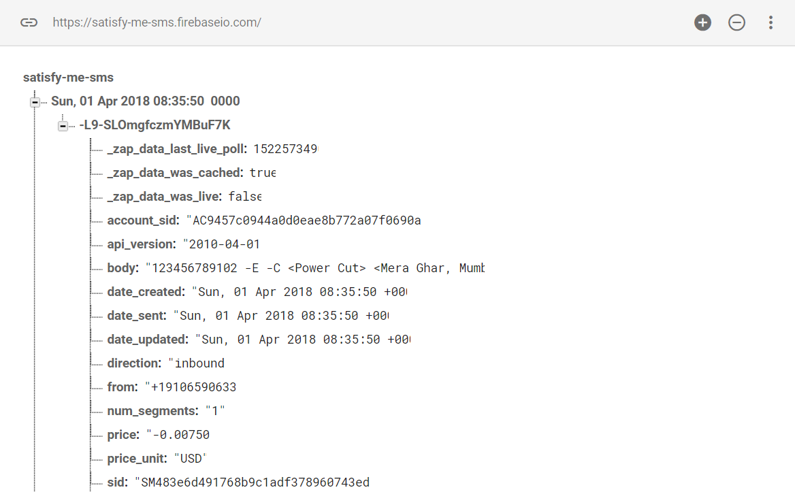
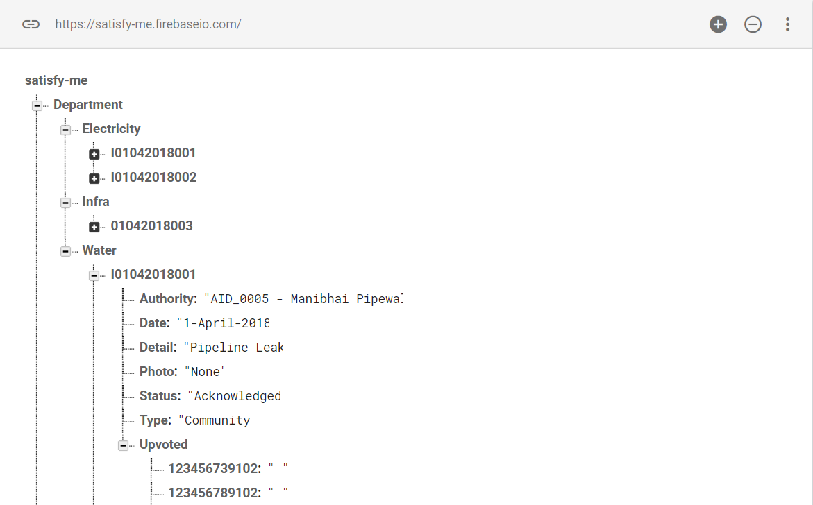
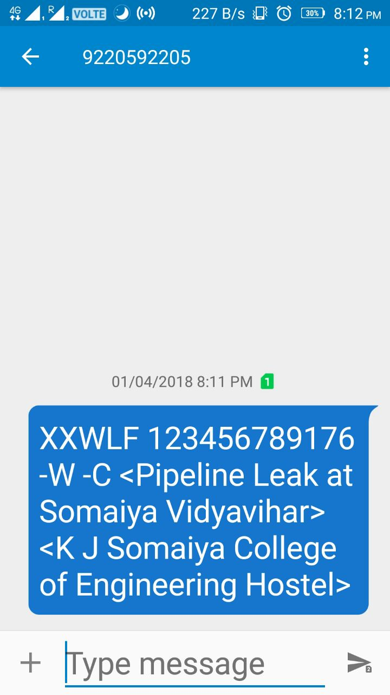

  

<h3 align="center">Satisfy.me</h3>

------------------------------------------

>Satisfy Me is a Public Grievance Redressal Management system where you submit your grievances from your area and get it resolved by the concerned authorities as quickly as possible.

>Check out the demo [here](https://drive.google.com/drive/folders/1h_iS-qyv2xd4fbd3du-nHF0qu0-XWX-3?usp=sharing)

>It has 3 parts. `First is a User-side mobile application and web-app`, `Second is an authority-side web application`, `Third is the workman side application where in he can update if he has solved the issue by going to the address`. People can post the daily life problems they are facing like power cuts, water shortage, garbage disposal, etc via SMS or the app and it will get updated on the Government Authorities application. Other people can upvote the problems if they're facing the same. More the upvotes, more will be the severity of the problem and the quicker it'll get solved. The department will send a concerned team to the address and get the issue solved. Once it's solved, it gets marked as solved.

> The SMS gets recorded on our database and then added to the departmental server.

  

> The web app data gets recorded on a different database and then added to the same departmental server so that all your queries stay in sync.

  

------------------------------------------

### Features

- Public Grievance Redressal
- Direct Contact with the concerned authorities
- People can post their grievances like `pipeline bursts`, `power cuts`, etc
- Grievance submission by SMS
- Real time status tracking of your problem resolution

------------------------------------------

### To Do

- [x] Add Grievance
- [x] Solved by Department
- [x] Grievance by SMS
- [x] User Dashboard and Feedback

------------------------------------------

### SMS Functionality Instructions

> You can avail our service by sending an SMS in the following format: 
> XXWLF UIDAI -Department -Type 
 <Address>
- XXWLF is a keyword
- Followed by your 12 digit UIDAI Aadhar Number
- Department is to be replaced by any of the four available departments namely Electricity, Water, Health, Infrastructure.  `-E/-W/-H/-I`
- Type refers to the scope of the problem. Personal or Community. `-P/-C`
- These are followed by the description and address wrapped in respective chevron pairs.

  

------------------------------------------

### Note

- This project was made at Hack-n-Code NMIMS.
- All API keys and auth tokens have been removed for personal security reasons and have been replaced by `key` instead. You'll have to add your own `firebase authorization key`, `twilio api key`, `text local api key` for it to work.

------------------------------------------

### Contributors

- [Karan Agrawal](https://github.com/karan28598)
- [Shreyansh Kotak](https://github.com/shreyanshkotak)
- [Ashwin Tantri](https://github.com/ashwintantri)

------------------------------------------